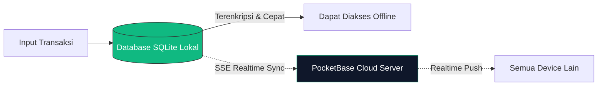

# Design Specification: Landing Page Uwangku
Versi: 1.0
Pendekatan: Human-Centric, Ultra-Minimalist, Premium Dark Mode Default, Glassmorphism Accent

---

## 1. Tema Visual & Filosofi
Desain Uwangku Landing Page merefleksikan filosofi aplikasi Flutter-nya: **Bebas dari kekacauan finansial**. Antarmuka tidak boleh dipenuhi oleh grafik tebal atau teks promosi yang agresif. Sebaliknya, gunakan ruang kosong yang luas (whitespace), tipografi yang elegan, dan transisi halus yang memberikan ketenangan pikiran mengenai uang mereka.

---

## 2. Sistem Desain & Token Visual

### 2.1 Palet Warna (Tailored Slate & HSL Gradients)
Untuk menghadirkan kesan premium, kita menghindari warna dasar generik.
* **Primary / Accent Color**: `#10B981` (Emerald/Mint Green - melambangkan uang dan pertumbuhan finansial sehat).
  * HSL: `hsla(160, 84%, 39%, 1)`
* **Dark Background (Default)**: `#0F172A` hingga `#020617` (Deep Slate/Midnight).
  * HSL Base: `hsla(222, 47%, 11%, 1)`
* **Card Background (Glassmorphism)**:
  * Background: `rgba(30, 41, 59, 0.5)`
  * Border: `rgba(255, 255, 255, 0.05)`
  * Backdrop Blur: `12px`
* **Text Colors**:
  * Primary Text: `#F8FAFC` (Slate 50)
  * Secondary Text: `#94A3B8` (Slate 400)

### 2.2 Tipografi
* **Hero Heading**: `Outfit` atau `Inter` (Google Fonts). Gunakan font-weight `700` atau `800` dengan letter-spacing sedikit rapat (`tracking-tight`).
* **Body / UI Elements**: `Inter` dengan font-weight `400` dan `500` untuk keterbacaan yang tajam.

---

## 3. Komponen Utama & Interaksi

### 3.1 Hero Section dengan Deteksi OS
Komponen tombol unduh utama menggunakan deteksi `navigator.userAgent` secara dinamis:
```typescript
// Logika Tombol Unduh Utama
const getOS = () => {
  if (typeof window === 'undefined') return 'windows';
  const userAgent = window.navigator.userAgent.toLowerCase();
  if (userAgent.indexOf('win') !== -1) return 'windows';
  if (userAgent.indexOf('android') !== -1) return 'android';
  return 'windows'; // default fallback
}
```
* **Visual Tombol**: 
  * Tombol Utama: Berwarna Hijau Mint (`#10B981`) dengan efek *shadow glow* warna senada.
  * Tombol Sekunder: Border transparan dengan efek glassmorphism yang mengarah ke bagian "Opsi Platform Lain".

### 3.2 Simulator NLP Chat Interaktif
Sebuah komponen kartu interaktif yang mensimulasikan fitur NLP AI Teks Uwangku:
* **UI**: Berbentuk seperti gelembung chat minimalis.
* **Interaksi**: Pengguna dapat memilih salah satu dari 3 tombol preset teks santai:
  1. `"Gaji masuk 5 juta"`
  2. `"Beli kopi starbucks tadi siang 50 ribu"`
  3. `"Bayar kostan 1.5 juta"`
* **Efek Animasi**: Ketika diklik, teks akan diketik otomatis (*typing effect*), lalu di bawahnya akan muncul kartu transaksi terstruktur yang dianimasikan meluncur ke atas:
  ```json
  {
    "tipe": "keluar/masuk",
    "nominal": "Rp 50.000",
    "kategori": "Makanan",
    "catatan": "Kopi Starbucks"
  }
  ```

### 3.3 Visualisasi Aliran Data (Local-First to PocketBase Cloud)
Mermaid Diagram yang menggambarkan alur sinkronisasi data yang diwujudkan dalam ilustrasi animasi CSS di landing page:


---

## 4. Grid Unduhan Aplikasi (Download Grid)
Tabel tata letak layout untuk bagian download:

| Platform | Format File | Action Button | Keterangan / Status |
| :--- | :--- | :--- | :--- |
| **Windows Desktop** | `.exe` (Installer) | `Unduh untuk Windows` | Rilis Stabil v1.0 |
| **Android Mobile** | `.apk` (Direct Download) | `Unduh .APK langsung` | Rilis Stabil v1.0 |
| **Android Play Store**| Google Play Store | `Temukan di Play Store` | Rilis Stabil v1.0 |
| **Web Browser** | Nuxt/Vite App | `Coming Soon` (Disabled) | Dalam Tahap Pengembangan |

---

## 5. Micro-Animations (Framer Motion)
1. **Fade In Up**: Terapkan pada semua heading dan kartu fitur saat discroll masuk ke viewport (`whileInView`).
2. **Hover Scale**: Tombol unduh membesar sedikit (`scale: 1.05`) dengan efek transisi transisi pegas (`type: "spring", stiffness: 400`).
3. **Card Glow Effect**: Arahkan kursor ke kartu fitur untuk memicu gradasi radial bercahaya halus yang mengikuti posisi kursor (CSS Mouse Hover Effect).
